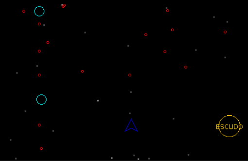
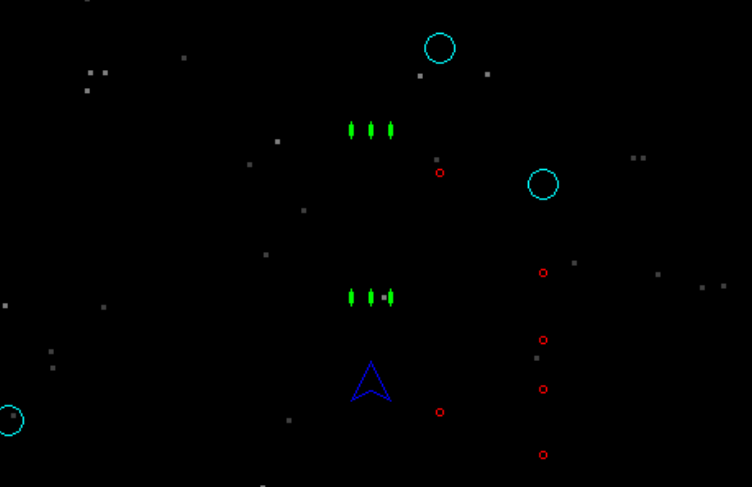

# EP Computação Orientada a Objetos

## Shoot em UP Game

Embora funcione, seu código não foi elaborado seguindo bons princípios de orientação a objetos.
Apesar de escrito em Java, o código foi elaborado seguindo um estilo de programação procedural e,
mesmo considerando este estilo, não muito bem feito uma vez que há muito código redundante.
Existem portanto inúmeras oportunidades de melhoria do código. Os dois principais aspectos que
devem ser trabalhados no desenvolvimento deste projeto são:
- A **aplicação de princípios de orientação a objetos**, através da criação de uma boa estrutura de
interfaces e classes bem encapsuladas, definição de uma hierarquia de classes/interfaces
adequada, e uso de recursos como herança/composição.
- O uso das coleções Java ao invés de arrays para manter/gerenciar as entidades do jogo que
aparecem em multiplicidade (inimigos, projéteis, etc).

O código do jogo é composto por dois arquivos fonte: Main.java e GameLib.java. No primeiro
arquivo está implementada toda a lógica do jogo, enquanto o segundo implementa uma mini biblioteca
com recursos úteis no desenvolvimento de jogos: inicialização da interface gráfica, desenho de figuras
geométricas simples e verificação de entrada através do teclado.

O foco da reescrita de código deve ser a classe Main. Pode-se assumir que a classe GameLib é uma
biblioteca fechada à qual não se tem acesso ao código-fonte (como se realmente fosse uma biblioteca
feita por terceiros) e, portanto, ela não precisa ser modificada neste trabalho, apenas utilizada.

## Atualizações feitas no código
Para uma melhor organização das classes, foi criada uma nova Pasta para o pacote "game"
- classes referentes às entidades do jogo serão agrupadas nesse pacote
  - Player
  - Projectile
  - Enemy
  - BackgroundElement

Ajuda na organização das classes, além de realizar melhor o controle com os modificadores de acesso, como public e private, por exemplo

## Dérick YO 20/06/2025
Galera, não entendi se devia criar mais pacotes então fiz tudo na main, yo

A primeira coisa a se notar ao analisar o código original da main é a sua extensão, possuindo 669 linhas, por conta disso decididmos dividir em 3 partes:
1a parte: tirar conteúdo desnecessário do código original e fazer pequenas melhorias
2a parte: melhorar a base do código para colocar os power-ups, chefes de fase e fases
3a parte: implementar os power-ups, chefes de fase e fases

  1a parte:
  A 1a coisa a se notar, é que tudo está na 'public class Main' e isso é muito ruim, pois tudo está em apenas uma classe, tem vários dados espalhados e que se repetem, e melhoraria muito a coesão se a gente tentasse separar e colocar sentido em alguns números que aparecem 'jogados'.

A 1a coisa coisa feita foi atribuir constantes para algumas propriedades que se repetem para para facilitar ainda mais a coesão

    /* constantes para temporização e duração de explosões    */
    public static final long PLAYER_EXPLOSION_DURATION = 2000;
    public static final long ENEMY_EXPLOSION_DURATION = 500;
    
    public static final long PLAYER_EXPLOSION_DURATION = 2000;
    public static final long ENEMY_EXPLOSION_DURATION = 500;
    
    public static final double PLAYER_INITIAL_VELOCITY = 0.25;
    public static final double PLAYER_RADIUS = 12.0;
    public static final double ENEMY1_RADIUS = 9.0;
    public static final double ENEMY2_RADIUS = 12.0;
    public static final double PROJECTILE_RADIUS = 2.0;
    public static final double COLLISION_FACTOR = 0.8;

Por mais que alguns desses só sejam usadas uma única vez (tal como ENEMY_EXPLOSION_DURATION, que só fora utilizado na linha 295 do código original com valor 500) ajuda muito para entender rapidamente o que está acontecendo no código.

Depois foi criada classes, para facilitar a alteração e manipulação do código, no jogo, percebemos que temos esses 4 elementos:
- Player
- Inimigos
- Projeteis
- Estrelas
Considerando que o código original estava com o nome dos elementos em inglês, decidimos seguir nesse formato, para entender de forma mais fácil o estado do nosso código atual e comparar com o original

Na classe de Player(jogador), foi inserito o estado, posicao, tempo para explosao e proximo momento permitido para disparo

    // jogador (entidade controlada pelo usuário)
    static class Player {
        int state = ACTIVE; // estado inicial
        double x, y; // posicao
        double explosion_start, explosion_end; // para o tempo de explosão
        long nextShot; // proximo momento permitido para disparo
    }
Tentamos manter em todas as classes nomes de variaveis usadas e repetidas no código original

Na classe inimigo, é bem interessante notar que há 2 tipos de inimigos, as 'esferas cianas' (tipo1) e a 'cobra magenta' (tipo2)

    // inimigo
    static class Enemy {
        int type; // tipo 1 ou 2
        int state = INACTIVE; 
        double x, y; // posicao
        double v; // velocidade escalar
        double angle; // angulo da direcao
        double vr; // velocidade rotacao
        long nextShoot; // prox momento que pode disparar
        double explosionStart, explosionEnd; // temporizador
    }
Classe projetil

    // projétil (disparado pelo jogador ou inimigos)
    static class Projectile {
        int state = INACTIVE;
        double x, y; // posicao
        double vx, vy; // velocidade
    }

Classe estrelas

    // estrelas
    static class Stars {
        double x, y; // posicao
    }

No código original, havia muitas arrays, e a gente fez o possível para mudar para coleções dinamicas com encapsulamento

Outra coisa que se repetia muito, de modo desnecessario, era verificar explosão
Original 217 - 225, 233 - 241, 247 - 255, 264 - 276, que seguia essa estrutura básica, dentro de for com o tamanho da coisa atingida:

    for(int i = 0; i < COISA_states.length; i++){
    double dx = A_X - B_X;
    double dy = A_Y - B_Y;
    double dist = Math.sqrt(dx * dx + dy * dy);
    
    if(dist < (RAIO_A + RAIO_B) * 0.8) {
        // Colisão detectada!
      }
    }

Isso é muito redundante de se ficar repetindo, então foi criada esse boolean

    /* verifica colisão entre duas entidades */
    private static boolean checkCollision(double x1, double y1, double r1, double x2, double y2, double r2) {
        double dx = x1 - x2;
        double dy = y1 - y2;
        double dist = Math.sqrt(dx * dx + dy * dy);
        return dist < (r1 + r2) * COLLISION_FACTOR;
    }

No método principal foi reduzido a quantidade de variaveis e foi começado a se utilizar coleções para deixar o código melhor
No código atual, é das linhas 100 - 112 as variaveis e as coleções são das linhas 116 - 120
Foi usada, nessa linha especifica a ArrayList, agora será abordado as as 4 importações do novo código e o motivo delas

    import java.util.ArrayList;
  Implementar listas dinâmicas para melhor gerenciamento dos elementos e entidades do jogo
  
    import java.util.Iterator;
  Percorrer coleções e remover elementos de forma segura
  
    import java.util.List;
  Interface comum
  
    import java.util.Random;
  Valores mais aleatorios para inimigos, velocidades, intervalos de disparo etc

Após isso também foram inicializas as estrelas de forma randomica, nas linhas 124 - 137

Agora é a parte do loop principal
Alteramos usando algumas das constantes que colocamos no inicio e o boolean checkCollision para verificar as explosões, usando só 2 loops, um do jogador com os projeteis inimigos e outro do jogador com os inimigos
Linhas 184 - 227

Em 'Atualizações de estados', na parte de projeteis foi usado iteradores para ter remoção segura e parou deter verificações manuais de estado
Linhas 235 - 270

No de comportamento de inimigos, juntou para ter os dois tipos de inimigos (não fica tão redundante), iterador para remoção e tudo fica mais fácil de entender pois estão no mesmo fluxo.
Linhas 273 - 374

Na parte de inimigos serem 'lançados' (spawnnados), graças aos esforços passados foi substituido as partes de arrays para criação direta de objetos com uso de listas dinamicas, a forma de manutenção é por temporizadores
Linhas 378 - 422

A parte de explosão do player só mudamos para que seja if( && ) que não tem sentido ter um if dentro de outro se pode usar &&

Agora em 'Verificando entrada do usuário (teclado)', só foi deixado tudo mais centralizado com criação direta dos projeteis (não precisa mais dos indices livres pois não está sendo usada arrays) e constantes para valores (definidas no inicio).
Linhas 434 - 457

Em 'Desenhor da cena', que é a parte de renderização de tudo, foi separado as camadas de renderização, usando as classes para facilitação, uso de loops for para ser mais simples, não teve muitas alterações
Linhas 475 - 548

## PowerUps

### Adição de Métodos Utilitários ao GameLib.java

Para aprimorar as capacidades gráficas e de detecção do jogo, dois novos métodos estáticos foram implementados na classe `GameLib.java`

`drawText(String text, double x, double y)`: Este método permite que textos sejam renderizados diretamente na tela do jogo, facilitando a exibição de informações visuais como rótulos de power-ups, mensagens de feedback, ou indicadores de interface.

`checkCollision(double x1, double y1, double r1, double x2, double y2, double r2)`: Um método fundamental para a lógica de jogo, responsável por determinar se dois objetos circulares (representados por suas coordenadas centrais e raios) estão em colisão. Este método é crucial para a interação entre o jogador, inimigos, projéteis e power-ups."

### Adição de Power-ups: Aprimorando a Capacidade do Jogador
Para enriquecer a jogabilidade e introduzir elementos de recompensa e variação dinâmica, foram implementados três novos arquivos de classe relacionados aos power-ups, todos localizados sob o pacote `GameObjects.PowerUps`:

1. `PowerUp.java` (Base):

    Servir como base para todos os tipos de power-ups do jogo. Define características e comportamentos comuns como posição, raio de colisão, estado, movimento, tempo de vida na tela, e o método abstrato applyEffect() que será implementado pelas subclasses para aplicar o bônus específico ao jogador. Também inclui a lógica de detecção de colisão com o jogador e a desativação após a coleta.
  
2. `ShieldPowerUp.java`
   
    Consiste num power-up de defesa que concede ao jogador um escudo temporário. Ele, ao ser coletado, ativa um bônus de proteção por um período, absorvendo um impacto inimigo que, de outra forma, causaria dano à nave.
    
    Melhora o comportamento da nave ao coletar o ShieldPowerUp, a nave do jogador adquire uma camada de defesa temporária, representada visualmente por um círculo ciano ao seu redor. Funcionalmente, isso permite que o jogador resista a um único hit de inimigos ou projéteis inimigos sem perder pontos de vida, aumentando sua capacidade de sobrevivência.

    <figure>
      
      <figcaption style="text-align:center;">Representação visual do escudo de proteção não coletado pela nave do jogador.</figcaption>
    </figure>

3. `TripleShotPowerUp.java`
    
   Consiste num power-up ofensivo que aprimora o poder de fogo da nave do jogador, permitindo que ela dispare três projéteis simultaneamente por um período limitado.

    A coleta do TripleShotPowerUp eleva a capacidade ofensiva da nave. Em vez de um único projétil central, a nave passa a disparar um feixe de três projéteis, aumentando a área de cobertura e a probabilidade de atingir inimigos. Isso permite ao jogador atacar inimigos de forma mais eficiente.

    <figure>
      
      <figcaption style="text-align:center;">Representação do disparo triplo da nave.</figcaption>
    </figure>

### Detalhamento das Alterações e Integração dos Power-ups
Para a implementação dos power-ups foram realizadas alterações em diversas classes, visando a modularidade e a clareza do código.

1. **Constantes Adicionadas**
   - `POWERUP_RADIUS`: raio para o desenho de todos os power-ups
   - `DEFAULT_EFFECT_DURATION` definido internamente nas classes de power-ups, permitindo que cada powerUp tenha uma duração personalizada

2. **Classe `Player.java`**
  
   - Atributos booleanos (`hasShield`, `hasTripleShot`) e temporizadores (`shieldEndTime`, `tripleShotEndTime`) controlam a ativação e a duração de cada power-up

   - métodos (`activateShield`, `activateTripleShot`) são invocados quando o jogador coleta um power-up, ligando a funcionalidade
  
   - `update()` aprimorado para monitorar o tempo e desativar os efeitos automaticamente quando ele acaba

   - `hit()` alterado para que o escudo absorva um impacto, evitando dano à nave. A lógica de `shoot()` foi atualizada para, quando o projétil triplo ativo, criar e lançar três projéteis em vez de um apenas

3. **Classe `Main.java`**
  
    - `nextPowerUpSpawn` e uma nova lógica foram adicionados para determinar o momento e o tipo de power-up a ser gerado aleatoriamente na tela

    - Uma List para PowerUps criada para guardar e processar todas as instâncias ativas. ELa é iterada para mover os power-ups, verificar suas colisões com o jogador e remover aqueles que saem da tela ou expiram sem serem coletados

     - O desenho dos PowerUps foi integrado ao processo de renderização da cena, garantindo sua visibilidade